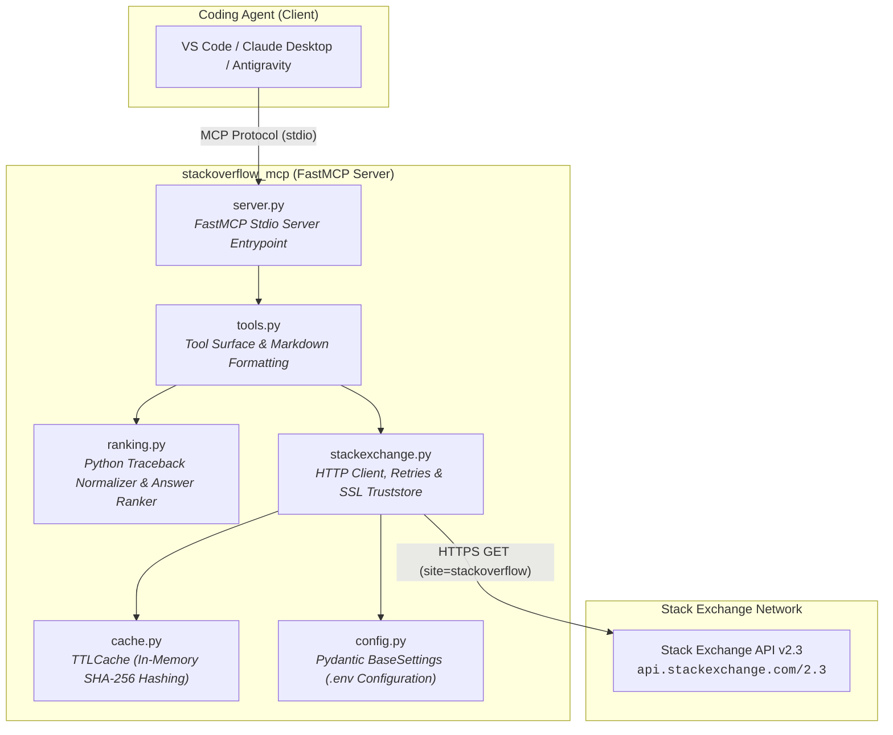
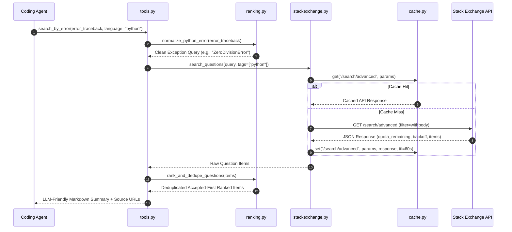

# Architecture Specification — `stackoverflow-mcp`

`stackoverflow-mcp` is designed as a single-file-per-concern FastMCP server optimized for low-latency retrieval of Stack Overflow solutions without requiring OAuth or internal LLM inference.

---

## 1. System Topology

### Request Execution Sequence

---

## 2. Design Principles

1. **Deterministic Retrieval**:
   * No internal LLM calls. Eliminates extra token costs and recursive latency.
2. **Accepted-First Ranking**:
   * Deduplicates search items by `question_id`.
   * Sorts questions with accepted answers (`is_answered` / `accepted_answer_id`) above non-accepted questions.
3. **Monotonic Rate-Limit Protection**:
   * Inspects `backoff` fields in Stack Exchange responses.
   * Uses monotonic clock timers (`time.monotonic()`) to enforce cool-down blocks before IP throttling occurs.
4. **Traceback Normalization**:
   * Regex-based cleaner strips noise (hex addresses `0x7f...`, paths, line numbers, timestamps, UUIDs) from error tracebacks to isolate the core Exception class and phrase.

---

## 3. Module Boundaries

| Module | Responsibility |
| :--- | :--- |
| `server.py` | Initializes `FastMCP("stackoverflow-mcp")`, registers tool handlers, starts stdio event loop. |
| `tools.py` | Formats search & question data into LLM-friendly Markdown output with source URLs. |
| `stackexchange.py` | Manages `httpx.AsyncClient`, retries, SSL truststore injection, and SE API v2.3 requests. |
| `ranking.py` | Pure deterministic functions for traceback normalization and accepted-first sorting. |
| `cache.py` | Dict-backed `TTLCache` mapping hashed canonical tuples `(endpoint, sorted_params)` to values. |
| `config.py` | Validates environment configuration using Pydantic `BaseSettings`. |
